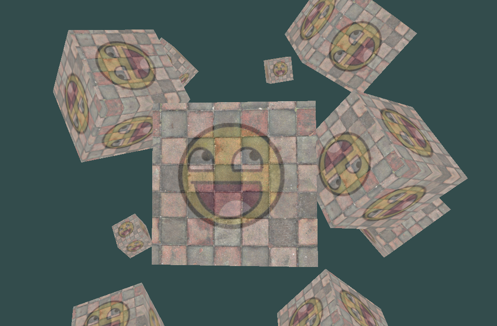

# Opengl learning

using opengl for learning CG

## [Project Page](https://github.com/Rascal0902/opengl_learn)

    
     
    opengl texturing cubes
     

## learn opengl site

click [url](https://learnopengl.com/) for website

## News 
*2024/10/18: Studied "Getting started"*

*2024/10/27: Studied "Lighting"*

## How to run

just clone the project and run the project
jetbrain clion is recommended
